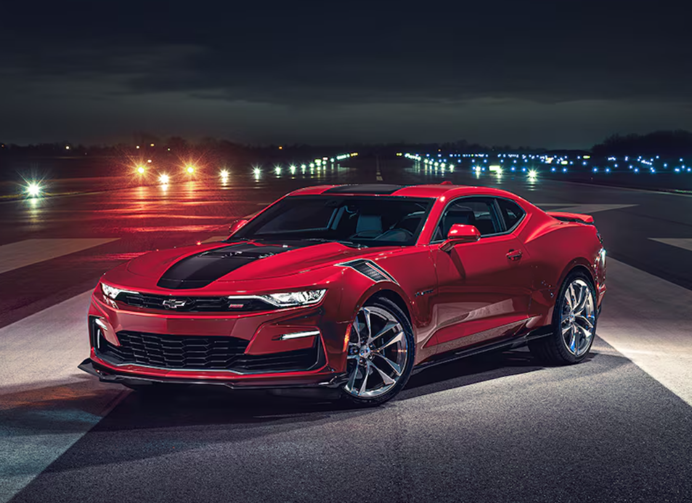
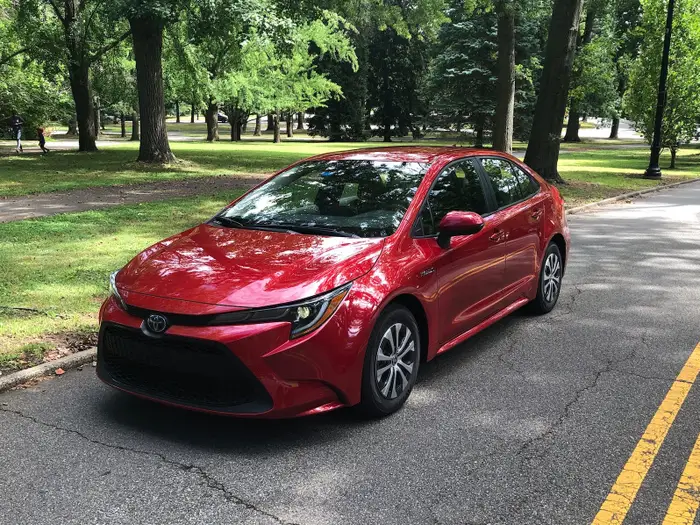

<html lang="en">
<head>
    <meta charset="UTF-8">
    <meta name="viewport" content="width=device-width, initial-scale=1.0">
    <title>Legendary Motorsport</title>
    
    
</head>
<body class="bg-gray-100 text-gray-900 relative">

 <!-- Background Animation -->

        

    

<!-- Welcome Section -->
 <section id="welcome" class="h-screen flex items-center justify-center text-center bg-gray-900 text-white">
        <h1 class="text-8xl font-extrabold fade-in">
            Welcome to Legendary Motorsport
        </h1>
    </section>

<!-- About Us Section -->
<section id="about" class="h-screen flex flex-col items-center justify-center text-center">
        <h2 class="text-7xl font-extrabold text-rose-600 fade-in mb-6">About Us</h2>
        

            Legendary Motorsport is the ultimate social media hub for car enthusiasts! Whether you're looking to share
            your experiences, troubleshoot car issues, or showcase stunning photos of your vehicle, our platform is here 
            for you. We aim to connect gearheads, provide solutions, and celebrate the love of cars.
        

    </section>

<!-- Our Mission Section -->
<section id="mission" class="h-screen flex flex-col items-center justify-center text-center bg-gray-200">
        
        <h3 class="text-6xl font-bold mt-8 text-gray-900 fade-in">Our Mission</h3>
        

            At Legendary Motorsport, we strive to create a community where car lovers can collaborate,
            share, and support each other. From vintage classics to modern supercars, every car has a story,
            and we’re here to help you tell yours.
        

    </section>

 <!-- Featured Cars Section -->
 <section id="featured-cars" class="py-20 bg-gray-100">
        <h2 class="text-7xl font-bold text-center text-red-600 mb-10 fade-in">Featured Cars</h2>
        

            

                
                

                    <h3 class="text-3xl font-bold mb-2">Gas Car</h3>
                    
The timeless classic fueled by gasoline, offering reliability and power.

                

            

            

                
                

                    <h3 class="text-3xl font-bold mb-2">Hybrid Car</h3>
                    
A perfect blend of fuel efficiency and eco-friendliness.

                

            

            

                
                

                    <h3 class="text-3xl font-bold mb-2">Electric Car</h3>
                    
The future of transportation, powered by clean and sustainable energy.

                

            

            

                
                

                    <h3 class="text-3xl font-bold mb-2">Dream Car</h3>
                    
A hypercar designed for the ultimate driving experience.

                

            

        

    </section>

 <!-- Testimonials Section -->
<section id="testimonials" class="py-20 bg-gray-900 text-white">
        <h2 class="text-7xl font-bold text-center mb-10 fade-in">What Our Users Say</h2>
        

            

                
"Legendary Motorsport is the best platform for car enthusiasts! I've learned so much and connected with amazing people."

                <h3 class="mt-4 font-bold text-lg">- Alex R.</h3>
            

            

                
"A fantastic community where I can share my car photography and get great feedback."

                <h3 class="mt-4 font-bold text-lg">- Jamie T.</h3>
            

            

                
"The forums have been super helpful for troubleshooting car problems. Highly recommended!"

                <h3 class="mt-4 font-bold text-lg">- Chris M.</h3>
            

        

    </section>

<!-- Call-to-Action Section -->
<section id="cta" class="h-screen flex flex-col items-center justify-center bg-gradient-to-r from-red-600 to-rose-600 text-white">
        <h2 class="text-7xl font-bold mb-6 fade-in">Join the Legendary Motorsport Community</h2>
        

            Connect with car enthusiasts from around the world, share your experiences, and explore amazing content about cars!
        

        <a href="#signup" class="bg-white text-red-600 text-3xl px-8 py-4 rounded-lg shadow-lg font-bold transition-transform transform hover:scale-110 fade-in">
            Get Started Now
        </a>
    </section>

 <!-- Footer -->
<footer class="bg-gray-800 text-white py-8">
        

            
&copy; 2024 Legendary Motorsport. All rights reserved.

            

                <a href="#" class="text-gray-400 hover:text-white mx-2">Facebook</a>
                <a href="#" class="text-gray-400 hover:text-white mx-2">Twitter</a>
                <a href="#" class="text-gray-400 hover:text-white mx-2">Instagram</a>
            

        

    </footer>

 <!-- JavaScript -->

 
</body>
</html>
